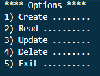

## Console Habit Tracker ##

This is my first CRUD application! It tracks whatever the user wants to track!

Made with C# and SQLite.

## Requirements 🗒️ ##

- Users need to be able to input the date of the occurrence of the habit

- The application should store and retrieve data from a real database

- When the application starts, it should create a sqlite database, if one isn’t present.

- It should also create a table in the database, where the habit will be logged.

- The users should be able to insert, delete, update and view their logged habit.

- You should handle all possible errors so that the application never crashes.

- You can only interact with the database using ADO.NET. You can’t use mappers such as Entity Framework or Dapper.

## Features 🧶 ##

- SQLite connection to store and read information. If the database does not exist, the program creates one on start.

- Console based UI to navigate by user input

- Users can Create, Read, Update or Delete entries :D

## Challenges & Lessons 💽##

- This was the first time I integrated a database to a program! I already knew SQL and some C#, but I've mostly worked with Python. It was fun to learn how to use a SQL connection on my program, and the C# documentation was really useful.

- I've tried to organize my code with methods, but I only made it more complicated to read. So I tried to use the KISS and DRY methodology to keep it simple and make it easier to understand.

## Areas to Improve 📔#

- Make the tables more user-friendly when printed!

- Organize the code better